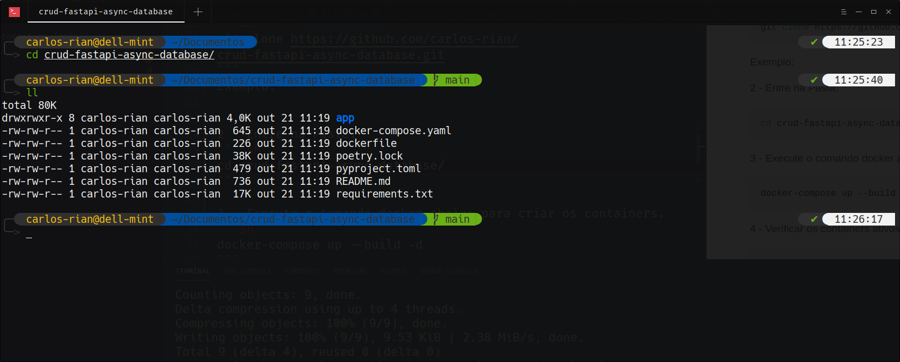

# CRUD FastAPI Com Database Async
Crud com FastAPI, SqlAlchemy e Databases.

## Descrição

Esse é um exemplo simples de API assincrona com FastAPI onde pode-se criar, ler, atualizar e deletar os dados de um banco de dados.
Basicamente esse "projeto" tem duas tabelas, sendo essas a de usuário e a de produtos.
Um relacionamento de 1-N, onde a tabela de produtos recebe o id do usuário. Então um usuário pode ter N produtos.

## Depências

- docker
- docker-compose

## Como instânciar o projeto?

1 - Faça o clone do repo.
```sh
git clone https://github.com/carlos-rian/crud-fastapi-async-database.git
```
Exemplo:


2 - Entre na Pasta.
``` sh
cd crud-fastapi-async-database/ && ll
```
Exemplo:


3 - Execute o comando docker abaixo para criar os containers.
```sh
docker-compose up --build -d
```
Exemplo:


4 - Verificar os containers ativos.
```sh
docker ps
```
Exemplo:


## Teste a Aplicação

1 - O ponto forte do FastAPI é que a documentação já vem pronta.
Então abra o navegador e cole a caminho abaixo.
```sh
127.0.0.1:8000/docs
```
Exemplo:


### Adendos
Ainda falta alguns endpoint e validações etc.
Mas é apenas um exemplo bem tranquilo para entender como funciona uma aplicação usando FastAPI de preferência em PT-BR.